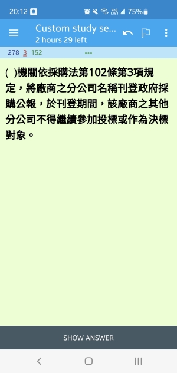

# GPA_Quiz_To_Anki

將 [政府電子採購網 > 採購法規題庫](https://web.pcc.gov.tw/psms/plrtqdm/questionPublic/indexReadQuestion) 之題庫轉成 Anki 卡片供練習使用

## Requirement
- [genanki](https://github.com/kerrickstaley/genanki)
- [pypdf](https://github.com/py-pdf/pypdf)

## Download Questions

- 需先至 [政府電子採購網](https://web.pcc.gov.tw/psms/plrtqdm/questionPublic/indexReadQuestion) 手動下載題庫, 勾選所有類別後點選查詢, 再選擇匯出(pdf)


- 匯出後再拉到網頁下方紀錄共有多少題目, 供最後產製完卡片核對使用


## Usage

```
python gpa_quiz_to_anki.py -i download.pdf -o out.apkg

# example
python gpa_quiz_to_anki.py -i example/gpa_quiz_1120608.pdf -o gpa_quiz.apkg

Parse: 工程及技術服務採購作業_選擇題
Count: 84
Parse: 工程及技術服務採購作業_是非題
Count: 210
Parse: 財物及勞務採購作業_選擇題
Count: 144
...
Parse: 政府採購法之罰則及附則_選擇題
Count: 50
Parse: 政府採購法之罰則及附則_是非題
Count: 231

 Total Quiz: 3714
```

## Limitation
- 部分依據法源因斷行格式會被抓進題目或選擇題選項內, 稍微影響閱讀, 但因為只有少數幾題, 就沒特別寫判斷式處理
- 因為試題類別是手動輸入, 若以後試題類別調整, 會造成部分題目抓不到類別, 必須手動修正

## Screenshots
使用 AnkiDroid 匯入畫面
- 是非題



- 選擇題


